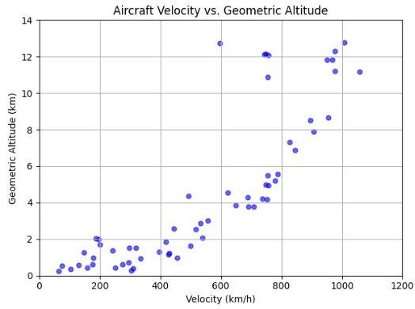
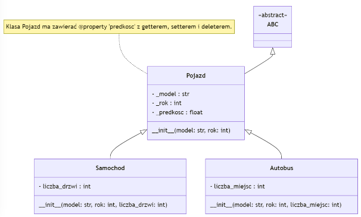
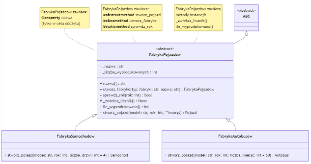
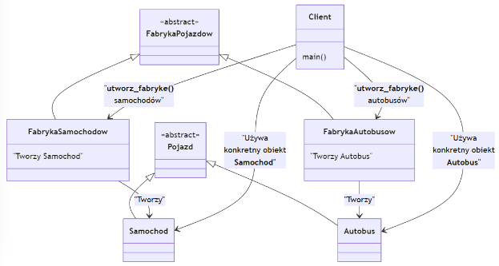

# Zestaw 4

# Zadanie 1

W tym zadaniu pozyskamy dane dotyczące ruchu lotniczego w obszarze wybranego lotniska, np. ATL (Atlanta, GA) i zapiszemy je do prostej bazy danych SQLite. Następnie odczytamy dane i wybrane informacje zaprezentujemy na wykresie. Bardzo często pozyskiwanie danych związane jest z korzystaniem określonego interfejsu (API) oraz wniesieniem opłaty. Na szczęście, serwis https://opensky-network.org/ udostępnia dane całkowicie bezpłatnie. OpenSky Network ma API, które umożliwia dostęp do aktualnych informacji o przestrzeni powietrznej, które reprezentują aktualny stan samolotów. API jest dostępne przez interfejs REST i oferuje powiązanie w języku Python. REST API to usługa, do której można wysyłać zapytania HTTP, aby uzyskać odpowiedzi w formacie danych, na przykład JSON. W praktyce polega to na skonstruowaniu odpowiedniego adresu URL z parametrami, który wywołuje konkretne dane z serwera. Szczegółowa dokumentacja dostępna jest na stronie https://openskynetwork.github.io/opensky-api/python.html, niemniej wystarczy nam minimalna wiedza. Omówimy teraz zagadnienia potrzebne do napisania treści funkcji:

```python
def fetch_flight_data(databasefile="flights.db")
```

przygotowanej w jednym z plików początkowych. Funkcja pobierze określone dane, a następnie zapisze je w bazie danych. Potrzebujemy wybrać obszar, na którym chcemy obserwować samoloty. Obszar ten definiuje się poprzez podanie granicznych współrzędnych długości i szerokości geograficznej. Na przykład, dla lotniska ATL oraz odległości ± 100 km, są to:

```
# AREA EXTENT COORDINATE WGS4 (for Atlanta Airport - ATL ± 100 km)
lon_min, lat_min = -85.4277, 32.6407
lon_max, lat_max = -83.4277, 34.6407
```

Następnie buduje się URL, aby pobrać dane dotyczące aktualnych stanów lotów dla określonego obszaru geograficznego. Polecam **założyć** bezpłatne konto w serwisie, wtedy możliwe jest odpytywanie danych co 5 sekund. Uzupełniamy poniższe zmienne swoim loginem i hasłem:
```
# REST API QUERY
user_name = 'twojlogin'   # Your OpenSky Network username
password = 'twojehaslo'   # Your OpenSky Network password
```

Tworzymy URL, zawierający nazwę użytkownika i hasło (w celu autoryzacji), oraz parametry określające obszar geograficzny: minimalną i maksymalną szerokość (`lat_min`, `lat_max`) oraz długość geograficzną (`lon_min`, `lon_max`):

```pyton
url_data = (
   'https://' + user_name + ':' + password +
   '@opensky-network.org/api/states/all?' +
   'lamin=' + str(lat_min) + '&lomin=' + str(lon_min) +
   '&lamax=' + str(lat_max) + '&lomax=' + str(lon_max)
)
```

Za pomocą funkcji `requests.get(url_data)` wysyłamy zapytanie do serwera:

```python
# Fetching data from the API
response = requests.get(url_data).json()
```

Dane są zwracane w formacie JSON i przypisane do zmiennej response, co pozwala na ich dalsze przetwarzanie. Warto w tym miejscu zrobić print, żeby zorientować się w strukturze danych. Przykładowy fragment:

```javascript
{'time': 1731539464, 'states': [['a5a8c3', 'N464DA  ', 'United States', 1731539463, 1731539463, -83.8178, 34.1901, 1005.84, False, 71.11, 305.87, -0.33, None, 1028.7, None, False, 0], ['ad5679', 'DAL3179 ', 'United States', .....
}
```

Jak widać, pierwszy jest znacznik czasu, podany w formacie UNIX timestamp, który reprezentuje liczbę sekund, jakie upłynęły od 1 stycznia 1970 roku. Można go łatwo przekształcić na bardziej czytelny format, korzystając z modułu `datetime` w Pythonie. Bardziej interesuje nas dalsza część, gdzie mamy klucz `states` i odpowiadającą mu listę z zagnieżdżonymi listami. Każda taka podlista to zestaw danych charakteryzujących konkretny samolot. Poszczególne pola będą kolumnami w strukturze danych `DataFrame`, zatem można im już teraz nadać odpowiednie nazwy, w postaci listy:

```python
col_name = [
    'icao24', 'callsign', 'origin_country', 'time_position', 'last_contact',
    'long', 'lat', 'baro_altitude', 'on_ground', 'velocity',
    'true_track', 'vertical_rate', 'sensors', 'geo_altitude',
    'squawk', 'spi', 'position_source'
]
```

Ich znaczenie jest następujące:
- `icao24`: unikalny identyfikator samolotu
- `callsign`: znak wywoławczy
- `origin_country`: kraj pochodzenia
- `time_position`: czas ostatniej aktualizacji pozycji
- `last_contact`: czas ostatniego kontaktu
- `long`: długość geograficzna
- `lat`: szerokość geograficzna
- `baro_altitude`: wysokość barometryczna
- `on_ground`: czy na ziemi (True/False)
- `velocity`: prędkość w m/s
- `true_track`: kierunek lotu względem północy
- `vertical_rate`: prędkość wznoszenia/opadania
- `sensors`: użyte sensory (opcjonalne)
- `geo_altitude`: wysokość geograficzna
- `squawk`: kod transpondera
- `spi`: status SPI (sygnał alarmowy)
- `position_source`: źródło pozycji

Tylko niektóre z nich wykorzystamy do wykonania wizualizacji, na przykład narysujemy wykres wysokości geograficznej (`geo_altitude`) w funkcji prędkości samolotu (`velocity`). Wysokość geograficzna to wysokość samolotu nad poziomem morza, zmierzona względem elipsoidy referencyjnej Ziemi (zwykle WGS84). To bardziej dokładna miara wysokości niż barometryczna, ponieważ uwzględnia rzeczywiste położenie nad powierzchnią ziemi, niezależnie od warunków atmosferycznych. Natomiast korzystając z dodatkowych baz danych można po identyfikatorze samolotu (`icao24`) dowiedzieć się, jaki jest to model, ale w tym zadaniu pominiemy to zagadnienie. Po odczytaniu danych, które znajdują się teraz w zmiennej `response`, z jej części `response['states']` należy utworzyć obiekt z biblioteki Pandas, czyli DataFrame. Nadajmy kolumnom nazwy z listy col_name. Taki obiekt można zapisać teraz w bazie danych (patrz poniżej, funkcja save_to_db).

Omówmy teraz pokrótce zagadnienia związane z utworzeniem, zapisywaniem i odczytywaniem danych do bazy danych. Baza danych jest powszechnym elementem w programach, w których pozyskuje i przetwarza się dane. Najprostszą, nie wymagającą praktycznie żadnej wstępnej konfiguracji, wbudowaną bazą danych jest SQLite. Obsługiwana jest ona w języku Python poprzez bibliotekę sqlite3, którą trzeba na początku zaimportować. W  pliku mamy funkcję `def create_table(max_repeats, databasefile="flights.db")`, w niej należy wykonać komendy związane z bazą danych. Zaczynamy od `connection = sqlite3.connect(databasefile)`, które otwiera (lub tworzy, jeśli nie istnieje) bazę danych o nazwie `databasefile`, czyli na przykład *flights.db*. Zwracany obiekt `connection` reprezentuje to połączenie. Następnie poprzez `cursor = connection.cursor()` tworzymy kursor. Kursor w SQLite (i innych bazach danych) to obiekt, który umożliwia wykonywanie zapytań SQL oraz zarządzanie wynikami tych zapytań. Kolejna linia, bardzo ważna, to utworzenie (o ile nie istnieje wcześniej) tablicy w bazie danych, czyli formalnej wewnętrznej struktury, w niej będą magazynowane wszelkie pozyskane dane. Funkcja `cursor.execute('''  tu będzie zapytanie SQL  ''')` powoduje wykonanie formalnej instrukcji z języka SQL. Nie jest naszym celem tutaj poznawanie składni SQL, zatem zastosujemy „gotową” formułę, która utworzy (o ile wcześniej nie utworzyła) w bazie danych na przykład tabelę o nazwie `airport_atl`, zawierającą składowe odpowiadające pozyskanym danym, wraz z określeniem w jakim typie będą one składowane w bazie. Sama instrukcja jest czytelna:
```sql
cursor.execute(
    '''CREATE TABLE IF NOT EXISTS airport_atl (
        icao24 TEXT,
        callsign TEXT,
        origin_country TEXT,
        time_position TEXT,
        last_contact TEXT,
        long REAL,
        lat REAL,
        baro_altitude REAL,
        on_ground TEXT,
        velocity REAL,
        true_track REAL,
        vertical_rate REAL,
        sensors TEXT,
        geo_altitude REAL,
        squawk TEXT,
        spi TEXT,
        position_source INTEGER
    )'''
)
```

Następnie należy zatwierdzić zmiany: `connection.commit()` zapisuje wprowadzone zmiany w bazie danych. Bez tego kroku tabela nie zostałaby faktycznie utworzona. Na koniec `connection.close()` zamyka połączenie z bazą, co jest dobrą praktyką i zwalnia zasoby. W przygotowanym kodzie widzimy również funkcję `def save_to_db(flight_df, databasefile="flights.db")`, która otwiera połączenie z bazą, metoda `to_sql()` zapisuje zawartość `flight_df` do `tabeli airport_atl` w bazie danych. Argumenty funkcji są dość oczywiste, argument `index=False` nie zapisuje indeksów `DataFrame` jako kolumn w tabeli. Połączenie zostaje zamknięte.
```python
def save_to_db(flight_df, databasefile="flights.db"):
    connection = sqlite3.connect("flights.db")
    flight_df.to_sql("airport_atl", connection, if_exists="append", index=False)
    connection.close()
```

Można też zaproponować inną strategię zarządzania plikiem z danymi. Na przykład, możemy zdecydować, że każde nowe uruchomienie programu takie, że będzie pozyskiwać dane z OpenSky Network, będzie kasować poprzednią tabelę i tworzyć nową. Wtedy kasowanie tabeli odbyłoby się za pomocą:
```sql
cursor.execute('''DROP TABLE IF EXISTS airport_atl''')
```

natomiast założenie nowej, instrukcją jak powyżej, ale bez `IF NOT EXISTS`.

Omówiliśmy wszystkie etapy pobrania i zapisania danych w bazie danych. Teraz zastanowimy się jak zaprogramować pobieranie danych na przykład co jakiś okres czasu, powtarzając procedurę określoną liczbę razy. Można zrobić pętlę, powtarzająca wywołanie funkcji `fetch_flight_data()`, w której na przykład za pomocą `time.sleep(30)` zatrzymamy kolejne iteracje na określony argumentem (tutaj 30 sekund) czas. Język Python dysponuje jednak ciekawszym narzędziem, a jest nim biblioteka `schedule` – prosty i elegancki sposób na harmonogramowanie zadań w Pythonie. Pozwala definiować zadania, które mają być wykonywane w określonych odstępach czasu, np. co kilka sekund, minut, godzin lub dni. W przeciwieństwie do ręcznego ustawiania opóźnień za pomocą `time.sleep()`, `schedule` pozwala zarządzać wieloma zadaniami i ich harmonogramem w jednym miejscu. Ideę wywołania funkcji `my_task()` np. co 5 sekund i określoną liczbę razy (poniżej – 12 razy) przedstawia ilustracyjny fragment kodu:

```python
import schedule
import time

# Licznik wywołań
call_count = 0

# Funkcja do wykonywania zadania
def my_task():
    global call_count
    print(f"Task executed {call_count + 1} times")
    call_count += 1
    if call_count >= 12:  # Zakończ po 12 wywołaniach
        return schedule.CancelJob

# Zaplanowanie funkcji co 5 sekund
schedule.every(5).seconds.do(my_task)

# Uruchamianie harmonogramu
while True:
    schedule.run_pending()
    time.sleep(1)  # opóźnienie dla zmniejszenia obciążenia CPU
```

Proponuję zatem, celem nazbierania danych o samolotach, wywołać funkcję `fetch_flight_data()` dziesięć razy, w odstępach co 60 sekund.

Druga część zadania polega na **narysowaniu** w postaci punktów zależności wysokości, na której leciał samolot w funkcji jego prędkości. Zatem musimy odczytać z powrotem dane z pliku bazy danych, najlepiej, ponownie do obiektu typu `DataFrame`. Oto proponowane rozwiązanie:

```python
# Function to read flight data from the SQLite database
def load_flight_data(databasefile="flights.db"):
    conn = sqlite3.connect(databasefile)
    flight_df = pd.read_sql_query("SELECT \* FROM airport_atl", conn)
    conn.close()
    return flight_df
```

W powyższej funkcji połączmy się z plikiem bazy danych i pobierzmy wszystkie pola tablicy `airport_atl`. Za pomocą funkcji `read_sql_query` dane są wczytane do formatu `DataFrame` (`pd` jest z: `import pandas as pd`). Dzięki temu mamy wczytaną ponownie tablicę Pandas i możemy na niej wykonywać selekcje. Na przykład, dobrym pomysłem jest odfiltrowanie pól, które nie zawierają danych. Oto ideowy przykład – załóżmy, że mamy tablicę o nazwie `flight_df` wypełnioną początkowo danymi typu:

| icao24 | velocity | geo_altitude |
| ------ | -------- |------------- |
| abc123 | 250.0    | 10000.0      |
| def456 | NaN      | 12000.0      |
| ghi789 | 300.0    | NaN          |
| jkl012 | 0.0      | 5000.0       |

Czasami podejściem jest zamiana pól `NaN` na coś innego, na przykład łańcuch znakowy 'No Data':
- `flight_df = flight_df.fillna('No Data')`

Tak można zrobić jeszcze w funkcji pobierającej dane `fetch_flight_data()`. Wtedy tablica wyglądałaby:

| icao24 | velocity | geo_altitude |
| ------ | -------- |------------- |
| abc123 | 250.0    | 10000.0      |
| def456 | No Data  | 12000.0      |
| ghi789 | 300.0    | No Data      |
| jkl012 | 0.0      | 5000.0       |

Niemniej, nie interesują nas dane niekompletne. Zatem możemy odfiltrować tak:
```python
flight_df = flight_df[flight_df['velocity'] != 'No Data'] 
flight_df = flight_df[flight_df['geo_altitude'] != 'No Data']
```
albo jeszcze lepiej, w jednej linii, żeby nie robić redundantnie skanowania całej tablicy:
```
flight_df = flight_df[ (flight_df['velocity'] != 'No Data') & (flight_df['geo_altitude'] != 'No Data') ]
```

Po filtrowaniu:

| icao24 | velocity | geo_altitude |
| ------ | -------- |------------- |
| abc123 | 250.0    | 10000.0      |
| jkl012 | 0.0      | 5000.0       |

Gdyby jednak w oryginalnej tablicy było zachowane `NaN`, to można takie filtrowanie wyegzekwować:
```python
flight_df = flight_df.dropna(subset=['velocity', 'geo_altitude'])
```

To jeszcze nie koniec – dane w tabeli są traktowane jako łańcuchy znakowe. Zatem przed narysowaniem, konieczna jest ich konwersja do wartości numerycznych (do typu `float64` z `numpy`), za pomocą funkcji `pd.to_numeric` – proszę sprawdzić też opcję `errors='coerce'`.

Na koniec jeszcze przeliczymy – metry na km, oraz prędkość m/s na km/h. Pewną komplikacją do rozstrzygnięcia jest fakt, że jeśli zapisywaliśmy dane **kilka razy**, to dany samolot prawdopodobnie został również zapisany wielokrotnie. Należy więc przyjąć strategię, że dla danego samolotu bierzemy do rysunku tę jego wartość, gdzie miał największą prędkość. Jeśli przykładowo samolot lądował, to pewnie wartością tą będzie pierwszy pomiar, a jeśli startował, zapewne ostatni pomiar. Jeżeli mamy tablicę o nazwie `flight_df`, to wykonajmy następującą operację:

```python
flight_df = flight_df.sort_values(by='velocity').drop_duplicates(subset='icao24', keep='first')
```

Ostatecznie, należy narysować punkty tak, żeby wyglądały podobnie do poniższego wykresu:

 

Podpowiedź: użyć `plt.scatter`, poeksperymentować takimi argumentami jak `alpha`, `s`, `color, marker. Oczywiście nie zapomnieć o podpisach, oraz ustawieniu zakresu osi X: 0-1200, Y: 0-14 (patrz funkcje  plt.xlim`, `plt.ylim`). Warto też przeczytać o funkcji `plt.tight_layout()`.

**Wymagania formalne** Użyć pliki z katalogu `zadanie_1/` w repozytorium GitHub Classroom do uzupełnienia swoim kodem. Pliki mają część kodu napisaną, aby nie eskalować trudności napisania całego kodu. Przedyskutujmy ich zawartość. Plik `main.py` pozostawiłem kompletny, nie wymaga żadnych uzupełnień, poza zmianami parametrów. Idea jest taka, że ustawiamy parametry `FETCH_INTERVAL` – co ile sekund odczyt danych, `MAX_REPEATS` – ile razy powtórzyć. Podczas testowania warto ustawić 1 i 1. Jeśli nie chcemy ściągać nowych danych, ustawienie `MAX_REPEATS = 0` powinno spowodować odczytanie zapisanego wcześniej pliku `flights.db`. Proszę się przyjrzeć, jak poprzez `schedule` uruchamiane są kolejne wywołania `fetch_flight_data()`. Plik `database.py` zawiera trzy funkcje, `create_table(max_repeats, databasefile="flights.db")` oraz `save_to_db(flight_df, databasefile="flights.db")` i `load_flight_data(databasefile="flights.db")`, które zostały szczegółowo omówione. Plik `flight_data.py` ma dwie funkcje. Funkcja `fetch_flight_data(databasefile="flights.db")` służy do pozyskania danych z OpenSky Network do obiektu `flight_df` typu `DataFrame` i zapisania go do bazy danych. Funkcja `plot_flight_data(databasefile="flights.db", show_plot=True)` odczytuje dane z pliku bazy danych, czyli woła `load_flight_data(databasefile="flights.db")`, a następnie musi wykonać wszystkie te obróbki prowadzące do finalnego wykresu. Jak widać, funkcje mają domyślną nazwę pliku bazy danych. W testach tworzona jest tymczasowa baza danych, do tego celu korzysta się z modułu tempfile oraz konstrukcji:

```python
    with tempfile.NamedTemporaryFile(suffix=".db", delete=False) as temp_db:
        databasefile = temp_db.name # pełna ścieżka do utworzonego pliku tymczasowego
```

Testy sprawdzają poprawność wykreowania tablicy w bazie danych, zgodnie z wytycznymi powyżej opisanymi, łącznie z nazwami kolumn. Jeden z testów tworzy kontrolowane izolowane środowisko w celu przetestowania „pobierania” danych. Wreszcie, test sprawdza funkcję „rysującą” ale z argumentem `show_plot=False`, przez co `plt.show()` nie będzie wywołane – to dlatego jest taki argument w funkcji `plot_flight_data(databasefile="flights.db", show_plot=True)` [**zadanie za 2 pkt**].

# Zadanie 2

Przestudiujemy mechanizmy implementacji programowania obiektowego w Pythonie: dziedziczenie z klasy `ABC` jako realizacja mechanizmu definiowania klasy abstrakcyjnej, korzystania z mechanizmów `@property` (wraz z setter i deleter). Definiowana metod abstrakcyjnych (`@abstractmethod`), oraz metod klasy (`@classmethod`) i metod statycznych (`@staticmethod`). Zadaniem jest napisanie programu, opartego na wzorcu projektowym Fabryka Abstrakcyjna (https://pl.wikipedia.org/wiki/Fabryka_abstrakcyjna), na przykładzie produkcji pojazdów. Program powinien umożliwiać tworzenie dwóch rodzajów pojazdów – samochodów i autobusów – przy użyciu odpowiednich fabryk.

Należy zaimplementować klasę abstrakcyjną `Pojazd`, która powinna dziedziczyć z klasy `ABC`. Klasa ta musi zawierać atrybuty `_model`, `_rok` oraz `_predkosc`. Należy zaimplementować **właściwość** (dekorator `@property`) predkosc z dekoratorami: getterem, który zwraca aktualną wartość `_predkosc`, setterem pozwalającym na ustawienie prędkości (z walidacją, że prędkość nie może być ujemna – a jeśli jest ujemna, to zgłasza wyjątek `ValueError`) oraz deleterem, który przypisuje wartość `_predkosc = 0`. Klasy `Samochod` i `Autobus` dziedziczące z `Pojazd` powinny mieć **dodatkowe** atrybuty: `liczba_drzwi` dla samochodów i `liczba_miejsc` dla autobusów. Poniższy diagram UML (https://pl.wikipedia.org/wiki/Diagram_klas) przedstawia opisane zależności. Aby zrozumieć oznaczenia na diagramie, konieczne jest samodzielne zapoznanie się, choćby w minimalnym zakresie, z językiem notacji diagramów klas.



Należy również zaimplementować klasę abstrakcyjną `FabrykaPojazdow`, która powinna zawierać atrybut (`@property`) nazwa oraz metodę abstrakcyjną `stworz_pojazd`, wymuszającą implementację w klasach potomnych. Klasa ta powinna także zawierać metodę klasy `utworz_fabryke`, która na podstawie przekazanego typu fabryki (samochod lub autobus) utworzy odpowiednią instancję klasy fabryki. Ponadto, należy zaimplementować metodę statyczną `sprawdz_rok`, która sprawdza, czy rok produkcji mieści się w przedziale 1900–2024, metodę `_zwieksz_licznik`, zwiększającą licznik wyprodukowanych pojazdów, oraz metodę `ile_wyprodukowano`, zwracającą liczbę wyprodukowanych pojazdów. Klasy `FabrykaSamochodow` i `FabrykaAutobusow`, dziedziczące z FabrykaPojazdow, powinny odpowiednio implementować metodę stworz_pojazd.



Przykład działania programu jest zachowany w kodzie w pliku `zadanie_2/zadanie2.py`. Utworzone zostają dwie fabryki: fabryka samochodów i fabryka autobusów, korzystająca z metody klasowej `utworz_fabryke`. Kontrolnie drukujemy ich nazwy – demonstrując działanie `@property` nazwa. Następnie produkowany jest samochód - model Fiat, rok produkcji 2023 i liczbie drzwi 5 oraz jeden autobus - model Solaris, rok produkcji 2023 i liczbie miejsc 60. Następnie, pokazane jest pokazane jest też działanie getter, setterów i deleterów dla właściwości (`@property`) predkosc. Na koniec zwykła metoda obiektu (`ile_wyprodukowano`) zwraca liczbę wyprodukowanych samochodów i autobusów przez odpowiednie fabryki. Diagram (nieco „zakręcony”):



Ciekawostka: powyższe diagramy są wykonane za pomocą https://mermaid.live/, pliki `.json` z ich definicjami dodałem ekstra w podkatalogu `UML` plików z zadaniem.

**Wymagania formalne** Użyć plik z katalogu `zadanie_2/zadanie2.py` w repozytorium GitHub Classroom do uzupełnienia swoim kodem. Plik ma kompletną funkcję `main()`, która wyznacza oczekiwane działanie kodu. Poza tym są oczywiście testy, które powinny zostać spełnione [**zadanie za 1 pkt**].

# Zadanie 3

Dynamiczny charakter języka Python nie pozwala na bezpośrednie przeładowywanie funkcji o tych samych nazwach, ale różnych argumentach. Z pomocą dekoratorów pojawiają się w język techniki emulujące takie zachowania. W ramach zadania proszę przestudiować materiał na temat `singledispatch` (pojedyncza dyspozycja) oraz `singledispatchmethod` z modułu `functools` oraz napisać kod ilustrujący te przypadki.

Dokumentacja: https://docs.python.org/3/library/functools.html#functools.singledispatch

**Wymagania formalne** Użyć plik z katalogu `zadanie_3/zadanie3.py` w repozytorium GitHub Classroom do uzupełnienia swoim kodem. Jeden przykład dotyczy „polimorfizmu” działającego na pojedynczej funkcji globalnej `log_event(event)`, dla której należy napisać różne wersje reagowania dla typów `str`, `int`, `dict`. Podobnie, dla klasy `EventHandler` i metody `handle_event(self, event)`, należy napisać jej wersję dla argumentu typu `str`, `int` oraz `list`. Również dla klasy potomnej `DerivedHandler(EventHandler)`, należy napisać obsługę dla typu `int` oraz typu `float`. W tym ostatnim przypadku, dla sytuacji gdy „nadpisujemy” obsługę typu `int`, niestety wychodzą ograniczenia takiego rozwiązania. Problem wynika z mechanizmu dziedziczenia i rejestracji typów w `singledispatchmethod`. Gdy w klasie `DerivedHandler` rejestrujemy nową metodę obsługi typu `int`, nadpisujemy niestety poprzednią rejestrację z klasy `EventHandler`. Oznacza to, że każda próba obsługi typu `int` używa teraz metody z klasy `DerivedHandler`, nawet jeśli wywoła się ją na instancji `EventHandler`. Sytuację tę można „obejść”, ale rozwiązania są bardzo nieeleganckie i nie będziemy ich tu dyskutować. Bezpieczniej jest przyjąć, że `singledispatchmethod` nadal nie obejmuje bardziej skomplikowanych zastosowań (np. przypadków dziedziczenia) i w takich sytuacjach tego nie stosować [**zadanie za 1 pkt**].

# Zadanie 4

W tym zadaniu przyjrzymy się zewnętrznemu modułowi `multipledispatch` realizującemu wzorzec wielokrotnej dyspozycji  https://github.com/mrocklin/multipledispatch. Polega on na „emulowaniu” polimorfizmu, czyli wybraniu danej wersji funkcji o tej samej nazwie, na podstawie jej argumentów – jednego, lub więcej argumentów. W pliku `zadanie_5/zadanie5.py` zdefiniowane są na początku klasy: `Figura`, `Prostokat`, `Kwadrat`, `Kolo`. W dalszej części kodu chodzi o to, aby zdefiniować wersje funkcji o tej samej nazwie `pole`, ale różniące się argumentami oraz liczbą argumentów. Wywołanie funkcji `pole` będzie uzależnione właśnie od argumentów, w tym celu można właśnie użyć `multipledispatch` oraz dekorator `@dispatch`. Dla ułatwienia zrozumienia oczekiwanych efektów, pozostawiona jest zawartość testująca oraz testy. Można to zastosować do implementacji metod instancji klasy, ale niestety nie działa w złożeniu z `@classmethod`.

**Wymagania formalne**  Użyć plik z katalogu `zadanie_4/zadanie4.py` w repozytorium GitHub Classroom do uzupełnienia swoim kodem. Część kodu obrazująca spodziewane działanie jest obecna. W komentarzach wymienione jest precyzyjnie, jakie wersje należy zaimplementować. Kod powinien również przejść testy.

Dodatkowa możliwość – inna opcja realizacji wzorca wielokrotnej dyspozycji to zewnętrzny moduł `plum` https://github.com/beartype/plum. Moduł `plum` oferuje kilka kluczowych zalet w porównaniu do `multipledispatch`, które czynią go bardziej nowoczesnym i elastycznym narzędziem do realizacji *multiple dispatch* w Pythonie. Jedną z głównych zalet jest wsparcie dla zaawansowanego typowania opartego na module `typing`, co pozwala na dokładniejsze definiowanie typów argumentów, takich jak `List[int]`, `Dict[str, float]`, czy `Optional[str]`, co nie jest bezpośrednio możliwe w `multipledispatch`. `plum` automatycznie rejestruje funkcje na podstawie ich sygnatur, eliminując konieczność jawnego wskazywania typów w dekoratorach, co upraszcza kod i sprawia, że jest bardziej czytelny. Ponadto, `plum` obsługuje dziedziczenie typów – w przypadku braku funkcji zdefiniowanej dla typu podrzędnego, automatycznie wywoływana jest funkcja zdefiniowana dla typu nadrzędnego, co zapewnia bardziej intuicyjne działanie i minimalizuje potrzebę powtarzania kodu. `plum` lepiej radzi sobie z dynamicznymi konwersjami typów, takimi jak rzutowanie `int` na `float`, jeśli brak jest odpowiedniej funkcji dla typu `int`. Dodatkowo, `plum` pozwala na stosowanie *multiple dispatch* nie tylko w funkcjach globalnych, ale także w metodach klasowych i instancyjnych, co zwiększa jego wszechstronność. Wreszcie, prostota użycia plum wynika z braku potrzeby jawnej rejestracji funkcji – wystarczy użyć dekoratora `@dispatch`, aby funkcja została automatycznie dopasowana do odpowiednich typów, co zmniejsza ryzyko błędów i upraszcza zarządzanie kodem. Te cechy sprawiają, że `plum` jest bardziej zaawansowanym narzędziem do *multiple dispatch*, szczególnie w projektach wykorzystujących rozbudowane typowanie i złożone hierarchie klas [**zadanie za 1 pkt**].